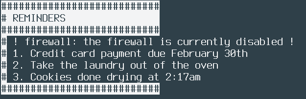

# bash-reminders
A few simple bash functions to display reminders in a nice container.



# Usage
Create ~/.autoreminders/ (directory) and ~/reminders (file) and place
the three functions in the file .bashrc from this repo in your ~/.bashrc.

Each line of text in ~/reminders is one reminder.

`addautoreminder` and `rmautoreminder` can be used elsewhere to show
in-your-face reminders that blink:
```bash
firewalloff()
{
    #disable the firewall
    addautoreminder firewall "firewall is currently disabled"
}

firewallon()
{
  #enable the firewall
  rmautoreminder firewall
}

```
